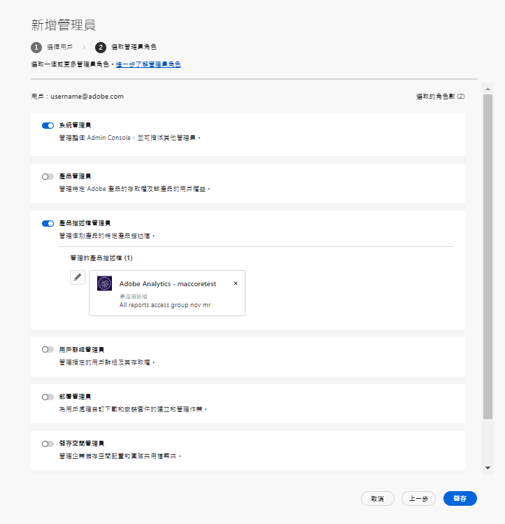

# 管理角色

使用Adobe Admin Console，組織可以定義靈活的管理層次結構，從而實現對Adobe產品訪問和使用的細粒度管理。 在企業登機過程中設定的一個或多個系統管理員位於層次結構的頂部。 這些系統管理員可以將職責委派給其他管理員，同時仍保留總體控制。

「管理角色」為企業提供了以下主要好處：

* 有控制地下放行政責任
* 按用戶和按產品快速查看產品分配
* 為產品管理員分配配額的功能

## 管理層次

適用於：Adobe企業客戶。

管理層次結構可用於滿足企業的獨特要求。 例如，企業可以指定不同的管理員來管理Adobe Creative Cloud和Adobe Marketing Cloud產品的權利。 或者，企業可以擁有不同的管理員來管理屬於不同業務部門的用戶的權利。

>[!NOTE]
>
>管理層次結構不適用於團隊客戶。 團隊客戶有 **系統管理員** 角色。 合同所有者(_以前稱為&#x200B;**主管理員**_)是系統管理員，可以訪問合同詳細資訊和計費歷史記錄。 如果您是當前合同責任人，則可以提名現有系統管理員(_&#x200B;以前稱為 **輔助管理員**_)作為合同所有者。

_管理員角色層次結構_

| 角色 | 說明 |
|--- |--- |
| **系統管理** | 組織的超級用戶；允許執行Admin Console中的所有管理任務。 此外，還有權將以下管理功能委派給其他用戶：產品管理員、產品配置檔案管理員、用戶組管理員、部署管理員和支援管理員。 |
| **產品管理** | 管理分配給該管理員的產品和所有相關管理功能，包括：<ul><li>建立產品配置檔案</li><li>向組織添加用戶和組，但不刪除這些</li><li>從產品配置檔案中添加或刪除用戶和用戶組</li><li>從產品配置檔案中添加或刪除產品配置檔案管理員</li><li>從產品中添加或刪除其他產品管理員</li><li>添加或刪除組管理員</li></ul> |
| **產品配置檔案管理** | 管理分配給該管理員的產品配置檔案說明和所有相關管理功能，包括：<ul><li>向組織添加用戶和組，但不刪除這些</li><li>從產品配置檔案中添加或刪除用戶和用戶組</li><li>從產品配置檔案中為用戶和用戶組分配或撤消產品權限</li><li>管理產品配置檔案的用戶和用戶組的產品角色 |
| **用戶組管理** | 管理分配給該管理員的用戶組描述和所有關聯的管理功能，包括：<ul><li>添加或從組中刪除用戶</li><li>添加或刪除組中的用戶組管理員 |
| **部署管理員** | 建立、管理和部署軟體包和更新到最終用戶。 |
| **支援管理員** | 有權訪問支援相關資訊的非管理角色，如客戶報告的發佈報告。 |
| **儲存管理** | 管理組織的儲存管理。 管理員可以查看活動和非活動用戶的儲存消耗量，並將內容傳輸到其他收件人。 |

有關每個管理員角色的權限和權限的詳細清單，請參見 [權限](#enterprise-admins-permissions-matrix)。

## 添加企業管理員角色 {#add-enterprise-role}

適用於：Adobe企業客戶。

作為管理員，您可以將管理員角色分配給其他用戶，為他們提供與您擁有的權限相同的權限，或按說明為層次結構中管理員角色下的角色授予權限 [上](#administrative-hierarchy)。 例如，作為產品管理員，您可以向用戶授予產品管理員權限或產品配置檔案管理員權限，但不授予部署管理員權限。 有關Admin Console的權限，請參見 [權限清單](#enterprise-admins-permissions-matrix)。

添加或邀請管理員：

1. 在 [Admin Console](https://adminconsole.adobe.com/)選項 **用戶** > **管理員**。

   或者，轉到相關產品、產品配置檔案或用戶組，然後導航到 **管理員** 頁籤。

1. 按一下 **添加管理員**。
1. 輸入名稱或電子郵件地址。 您可以通過指定有效的電子郵件地址並在螢幕上填寫資訊來搜索現有用戶或添加新用戶。
1. 按一下 **下一個**。 將顯示管理員角色清單。

>[!NOTE]
>
>* 此螢幕上的選項取決於您的帳戶和管理員角色。 您可以賦予與您擁有的權限相同的權限，也可以授予層次結構中您的角色的權限。
>* 作為團隊的系統管理員，您只能分配一個管理員角色：系統管理。

1. 選擇一個或多個管理員角色。
1. 對於管理類型（如產品管理員、產品配置檔案管理員和用戶組管理員），請分別選擇特定的產品、配置檔案和組。

>[!NOTE]
>
>對於「產品配置檔案管理員」，您可以包括多個產品的配置檔案。

1. 查看分配給用戶的管理員角色，然後按一下 **保存**。

用戶從接收有關新管理權限的電子郵件邀請 `message@adobe.com`。

用戶必須按一下 **開始** 的子郵件。 如果新管理員不使用 **開始** 連結，他們將無法登錄Admin Console。

作為登錄過程的一部分，如果用戶尚沒有Adobe配置檔案，則可能會要求他們設定登錄配置檔案。 如果用戶具有多個與其電子郵件地址關聯的配置檔案，則用戶必須選擇「加入團隊」（如果出現提示），然後選擇與新組織關聯的配置檔案。

## 添加團隊管理員 {#add-admin-teams}

適用於：Adobe團隊客戶。

作為管理員，您可以將系統管理員角色分配給其他用戶，並賦予他們與您相同的權限。

添加或邀請系統管理員：

1. 在Admin Console中，選擇 **用戶** > **管理員**。

   將顯示現有管理員的清單。

1. 按一下 **添加管理員**。

   的 **添加管理員** 螢幕。

1. 輸入名稱或電子郵件地址。 您可以通過指定有效的電子郵件地址並在螢幕上填寫資訊來搜索現有用戶或添加新用戶。

   預設情況下，系統管理員處於選中狀態。

1. 按一下 **保存**。

由於團隊組織中的所有用戶都是業務ID用戶，因此他們會收到一封電子郵件邀請，內容涉及團隊組織中的新管理權限 `message@adobe.com`。
用戶必須按一下電子郵件中的「開始」以加入組織。

作為登錄過程的一部分，如果用戶尚沒有Adobe配置檔案，則可能會要求他們設定登錄配置檔案。 如果用戶具有多個與其電子郵件地址關聯的配置檔案，則用戶必須選擇「加入團隊」（如果出現提示），然後選擇與新組織關聯的配置檔案。

## 編輯企業管理員角色

適用於：Adobe企業客戶。

作為管理員，您可以將管理員角色編輯到管理層次結構中位於您下面的其他管理員。 例如，您可以刪除其他管理員的管理員權限。

要編輯管理員角色：

1. 在Admin Console中，選擇 **用戶** > **管理員**。 將顯示現有管理員的清單。

   或者，轉到相關產品、產品配置檔案或用戶組，然後導航到 **管理員** 頁籤。

1. 按一下要編輯的管理員名稱。
1. 在 **用戶詳細資訊**&#x200B;按一下  為 **管理權** 選擇 **編輯管理員權限**。

   

1. 編輯管理權限並保存更改。

## 編輯團隊管理員角色

適用於：Adobe團隊客戶。

作為團隊系統管理員，您可以刪除其他管理員的系統管理員權限。

要撤消系統管理員權限，請執行以下操作：

1. 在Admin Console中，選擇 **用戶** > **管理員**。

   將顯示現有管理員的清單。

1. 在用戶詳細資訊中，按一下  權 **管理權** 選擇 **編輯管理員權限**。

   

1. 編輯管理權限並保存更改。

## 刪除管理員

適用於：Adobe團隊企業客戶。

1. 要撤消管理員權限，請選擇用戶，然後按一下 **刪除管理員**。

>[!NOTE]
>
>刪除管理員不會從Admin Console中刪除用戶，但只會刪除與管理員角色關聯的權限。

## 企業管理員權限清單

適用於：Adobe企業客戶。

下表列出了不同類型的管理員的所有權限，按以下功能區分類：

### 身份管理

| 權限 | 系統管理員 | 支援管理員 |
|--- |--- |--- |
| 添加域（請求/聲明域） | ✔ |  |
| 查看域和域清單 | ✔ |  |
| 管理域加密密鑰 | ✔ |  |
| 管理預設組織密碼策略 | ✔ |  |
| 查看預設組織密碼策略 | ✔ |  |

### 用戶管理

| 權限 | 系統管理員 | 支援管理員 |
|--- |--- |--- |
| 將用戶添加到組織 | ✔ |  |
| 從組織中刪除用戶 | ✔ |  |
| 查看用戶詳細資訊和清單 | ✔ |  |
| 編輯用戶配置檔案 | ✔ |  |
| 將產品配置檔案添加到用戶或組 | ✔ |  |
| 將產品配置檔案刪除到用戶或組 | ✔ |  |
| 將產品配置檔案添加到多個用戶 | ✔ |  |
| 查看用戶的產品配置檔案 | ✔ |  |
| 查看產品用戶清單 | ✔ |  |
| 批量將用戶添加到組織 | ✔ |  |

### 管理員管理

| 權限 | 系統管理員 | 支援管理員 |
|--- |--- |--- |
| 將組織管理員授予用戶 | ✔ |  |
| 從用戶撤消組織管理 | ✔ |  |
| 向用戶授予產品許可證管理 | ✔ |  |
| 從用戶撤消產品許可證管理 | ✔ |  |
| 將部署管理員授予用戶 | ✔ |  |
| 從用戶撤消部署管理 | ✔ |  |
| 將用戶組管理員授予用戶 | ✔ |  |
| 從用戶撤消用戶組管理 | ✔ |  |
| 將產品所有者管理員授予用戶 | ✔ |  |
| 從用戶撤消產品所有者管理 | ✔ |  |

### 產品許可證配置管理

| 權限 | 系統管理員 | 支援管理員 |
|--- |--- |--- |
| 將產品權利授予組織 |  |  |
| 從組織中刪除產品權利 |  |  |
| 查看組織擁有的許可證總數 | ✔ |  |
| 查看可用產品和產品系列 | ✔ |  |
| 編輯產品許可證說明/資料 | ✔ |  |
| 向用戶提供產品許可證 | ✔ |  |
| 從用戶取消置備產品許可證 | ✔ |  |
| 添加新產品許可證配置 | ✔ |  |
| 編輯產品許可證服務配置 | ✔ |  |
| 刪除產品許可證服務配置 | ✔ |  |
| 從用戶中刪除產品訪問（從所有配置中刪除） | ✔ |  |

### 儲存管理

| 權限 | 系統管理員 | 支援管理員 |
|--- |--- |--- |
| 查看活動和非活動用戶資料夾 | ✔ |  |
| 刪除非活動用戶資料夾並傳輸內容 | ✔ |  |

### 部署

| 權限 | 系統管理員 | 支援管理員 |
|--- |--- |--- |
| 查看/使用包頁籤 | ✔ |  |

### 支援

| 權限 | 系統管理員 | 支援管理員 |
|--- |--- |--- |
| 查看支援頁籤 | ✔ |  |
| 管理支援案例 | ✔ | ✔ |

### 用戶組管理

| 權限 | 系統管理員 | 支援管理員 |
|--- |--- |--- |
| 建立用戶組 | ✔ |  |
| 刪除用戶組 | ✔ |  |
| 將用戶添加到用戶組 | ✔ |  |
| 從用戶組中刪除用戶 | ✔ |  |
| 將用戶組分配給產品許可證 | ✔ |  |
| 從產品許可證中刪除用戶組 | ✔ |  |
| 查看用戶組的成員 | ✔ | ✔ |
| 查看用戶組清單 | ✔ | ✔ |
