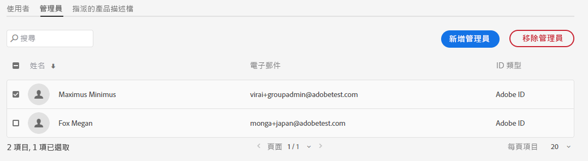

# 管理角色

使用 Adobe Admin Console，組織可以定義靈活的管理階層，從而可以細緻地管理 Adobe 產品的存取和使用。在企業上線過程中部署的一個或多個系統管理員位於此階層的最上層。這些系統管理員可以將職責委派給其他管理員，同時仍保留總體控制。

「管理角色」為企業提供了以下主要好處：

* 有控制地放權管理職責
* 按使用者和按產品快速檢視產品分配
* 向產品管理員指派配額的功能

## 管理階層

適用於：Adobe 企業客戶。

管理階層可用於滿足企業的獨特要求。例如，企業可以指定不同的管理員來管理 Adobe Creative Cloud 和 Adobe Marketing Cloud 產品的權利。或者，企業可以擁有不同的管理員來管理屬於不同業務部門的使用者的權利。

>[!NOTE]
>
>管理階層不適用於團隊客戶。團隊客戶有一個&#x200B;**系統管理員**&#x200B;角色。合約所有者（_舊稱為&#x200B;**主要管理員**_）是可以存取合約詳情和帳單歷史記錄的系統管理員。如果您是當前的合約所有者，則可以指定現有系統管理員（_&#x200B;舊稱為 **輔助管理員**_）作為合約所有者。

_管理員角色階層_

| 角色 | 說明 |
|--- |--- |
| **系統管理員** | 組織的進階使用者；允許執行 Admin Console 中的所有管理任務。 此外，還有權將以下管理功能委派給其他使用者：產品管理員、產品設定檔管理員、使用者群組管理員、部署管理員和支援管理員。 |
| **產品管理員** | 管理分配給該管理員的產品和所有相關管理職責，包括：<ul><li>建立產品設定檔</li><li>向組織新增使用者和使用者群組，但不能移除</li><li>向產品設定檔新增或移除使用者和使用者群組</li><li>向產品設定檔新增或移除產品設定檔管理員</li><li>向產品新增或移除其他產品管理員</li><li>向群組新增或移除群組管理員</li></ul> |
| **產品設定檔管理員** | 管理分配給該管理員的產品設定檔說明和所有相關管理職責，包括：<ul><li>向組織新增使用者和使用者群組，但不能移除</li><li>向產品設定檔新增或移除使用者和使用者群組</li><li>向產品設定檔的使用者和使用者群組指派或撤銷產品權限</li><li>管理產品設定檔的使用者和使用者群組的產品角色 |
| **使用者群組管理** | 管理分配給該管理員的使用者群組說明和所有相關管理職責，包括：<ul><li>向群組新增或移除使用者</li><li>向群組新增或移除使用者群組管理員 |
| **部署管理員** | 建立、管理和部署軟體套件並更新到最終使用者。 |
| **支援管理員** | 有權存取支援相關資訊的非管理角色，如客戶匯報的問題報告。 |
| **儲存管理員** | 管理組織的儲存管理。管理員可以查看作用中和非作用中使用者的儲存使用情況，並將內容傳輸到其他收件方。 |

有關每個管理員角色的權限和特權的詳細清單，請參見[權限](#enterprise-admins-permissions-matrix)。

## 新增企業管理員角色 {#add-enterprise-role}

適用於：Adobe 企業客戶。

作為管理員，您可以將管理員角色指派給其他使用者，授予他們與您擁有的相同權限，或者階層中您的管理員角色下的角色權限 [上](#administrative-hierarchy)。例如，作為產品管理員，您可以向使用者指派產品管理員權限或產品設定檔管理員權限，但不指派部署管理員權限。有關 Admin Console 的權限，請參見[權限矩陣](#enterprise-admins-permissions-matrix)。

新增或邀請管理員：

1. 在 [Admin Console](https://adminconsole.adobe.com/) 中，選擇&#x200B;**使用者** > **管理員**。

   或者，前往相關產品、產品設定檔或使用者群組，然後瀏覽&#x200B;**管理員**&#x200B;標籤。

1. 按一下&#x200B;**新增管理員**。
1. 輸入名稱或電子郵件地址。您可以透過指定有效的電子郵件地址並在螢幕上填充資訊來搜尋現有使用者或新增使用者。
1. 按一下&#x200B;**下一步**。將顯示管理員角色清單。

>[!NOTE]
>
>* 此螢幕上的選項取決於您的帳戶和管理員角色。您可以指派與您相同的權限，也可以指派階層中您權限下的角色權限。
>* 作為團隊的系統管理員，您只能指派一個管理員角色：系統管理員。

1. 選取一個或多個管理員角色。
1. 對於管理員類型（如產品管理員、產品設定檔管理員和使用者群組管理員），請分別選取特定的產品、設定檔和群組。

>[!NOTE]
>
>對於產品設定檔管理員，您可以包括多個產品的設定檔。

1. 查看指派給使用者的管理員角色，然後按一下&#x200B;**保存**。

使用者從 `message@adobe.com` 接收有關新管理權限的電子郵件邀請。

用戶必須按一下電子郵件中的「**開始使用**」以加入組織。如果新管理員不點擊電子郵件邀請中的&#x200B;**開始使用**&#x200B;連結，他們將無法登入 Admin Console。

在登入過程中，如果使用者沒有 Adobe 設定檔，那麼系統可能會要求他們設定一個。如果使用者具有多個與其電子郵件地址關聯的設定檔，那麼使用者必須選擇「加入團隊」（如果出現提示），然後選取與新組織關聯的設定檔。

## 新增團隊管理員 {#add-admin-teams}

適用於：Adobe 團隊客戶。

作為管理員，您可以將系統管理員角色指派給其他使用者，並賦予他們與您相同的權限。

新增或邀請系統管理員：

1. 在 Admin Console 中，選擇&#x200B;**使用者** > **管理員**。

   將顯示現有管理員的清單。

1. 按一下&#x200B;**新增管理員**。

   將顯示&#x200B;**新增管理員**&#x200B;畫面。

1. 輸入名稱或電子郵件地址。您可以透過指定有效的電子郵件地址並在螢幕上填充資訊來搜尋現有使用者或新增使用者。

   預設情況下，系統管理員處於選中狀態。

1. 按一下&#x200B;**保存**。

由於團隊組織中的所有使用者都是企業 ID 使用者，因此他們會收到一封來自 `message@adobe.com` 的電子郵件邀請，內容涉及新管理權限。
用戶必須按一下電子郵件中的「開始使用」以加入組織。

在登入過程中，如果使用者沒有 Adobe 設定檔，那麼系統可能會要求他們設定一個。如果使用者具有多個與其電子郵件地址關聯的設定檔，那麼使用者必須選擇「加入團隊」（如果出現提示），然後選取與新組織關聯的設定檔。

## 編輯企業管理員角色

適用於：Adobe 企業客戶。

作為管理員，您可以將管理員角色編輯給管理階層中位於您下面的其他管理員。例如，您可以移除其他管理員的管理員權限。

若要編輯管理員角色：

1. 在 Admin Console 中，選擇&#x200B;**使用者** > **管理員**。將顯示現有管理員的清單。

   或者，前往相關產品、產品設定檔或使用者群組，然後瀏覽&#x200B;**管理員**&#x200B;標籤。

1. 按一下要編輯的管理員名稱。
1. 在 **使用者詳細資訊**&#x200B;中，按一下&#x200B;**管理權**&#x200B;部分的，選擇 **編輯管理員權限**。

   

1. 編輯管理權限並保存更改。

## 編輯團隊管理員角色

適用於：Adobe 團隊客戶。

作為團隊系統管理員，您可以移除其他管理員的系統管理員權限。

若要撤銷系統管理員權限，請執行以下操作：

1. 在 Admin Console 中，選擇&#x200B;**使用者** > **管理員**。

   將顯示現有管理員的清單。

1. 在「使用者詳細資訊」中，按一下&#x200B;**管理權**&#x200B;部分右側的，選擇 **編輯管理員權限**。

   

1. 編輯管理權限並保存更改。

## 移除管理員

適用於：Adobe 團隊企業客戶。

1. 若要撤銷管理員權限，請選擇使用者，然後按一下&#x200B;**移除管理員**。

>[!NOTE]
>
>移除管理員不會從 Admin Console 中刪除使用者，但只會移除與管理員角色關聯的權限。

## 企業管理員權限矩陣

適用於：Adobe 企業客戶。

下表列出了不同類型的管理員的所有權限，按以下功能區分類：

### 身份管理

| 權限 | 系統管理員 | 支援管理員 |
|--- |--- |--- |
| 新增網域（請求/聲明域） | ✔ | |
| 查看網域和網域清單 | ✔ | |
| 管理網域加密金鑰 | ✔ | |
| 管理預設組織密碼原則 | ✔ | |
| 檢視預設組織密碼原則 | ✔ | |

### 使用者管理

| 權限 | 系統管理員 | 支援管理員 |
|--- |--- |--- |
| 將使用者新增到組織 | ✔ | |
| 從組織中移除使用者 | ✔ | |
| 檢視使用者詳情和清單 | ✔ | |
| 編輯使用者設定檔 | ✔ | |
| 將產品設定檔新增到使用者或群組 | ✔ | |
| 將產品設定檔從使用者或群組中移除 | ✔ | |
| 將產品設定檔新增到多個使用者 | ✔ | |
| 檢視使用者的產品設定檔 | ✔ | |
| 檢視產品使用者清單 | ✔ | |
| 將使用者批次新增到組織 | ✔ | |

### 管理員管理

| 權限 | 系統管理員 | 支援管理員 |
|--- |--- |--- |
| 向使用者授予組織管理員權限 | ✔ | |
| 撤銷使用者的組織管理員權限 | ✔ | |
| 向使用者授予產品許可管理員權限 | ✔ | |
| 撤銷使用者的產品許可管理員權限 | ✔ | |
| 向使用者授予部署管理員權限 | ✔ | |
| 撤銷使用者的部署管理員權限 | ✔ | |
| 向使用者授予使用者群組管理員權限 | ✔ | |
| 撤銷使用者的使用者群組管理員權限 | ✔ | |
| 向使用者授予產品所有者管理員權限 | ✔ | |
| 撤銷使用者的產品所有者管理員權限 | ✔ | |

### 產品許可設定管理

| 權限 | 系統管理員 | 支援管理員 |
|--- |--- |--- |
| 向組織授予產品權利 | | |
| 撤銷組織的產品權利 | | |
| 查看組織擁有的許可總數 | ✔ | |
| 查看可用產品和產品系列 | ✔ | |
| 編輯產品許可說明/資料 | ✔ | |
| 向用戶部署產品許可 | ✔ | |
| 從用戶取消部署產品許可 | ✔ | |
| 新增產品許可設定 | ✔ | |
| 編輯產品許可服務設定 | ✔ | |
| 刪除產品許可服務設定 | ✔ | |
| 移除用戶的產品存取權限（從所有設定中刪除） | ✔ | |

### 儲存管理

| 權限 | 系統管理員 | 支援管理員 |
|--- |--- |--- |
| 查看作用中和非作用中使用者資料夾 | ✔ | |
| 刪除非活動使用者資料夾並傳輸內容 | ✔ | |

### 部署

| 權限 | 系統管理員 | 支援管理員 |
|--- |--- |--- |
| 查看/使用「套件」標籤 | ✔ | |

### 支援

| 權限 | 系統管理員 | 支援管理員 |
|--- |--- |--- |
| 查看支援標籤 | ✔ | |
| 管理支援案例 | ✔ | ✔ |

### 使用者群組管理

| 權限 | 系統管理員 | 支援管理員 |
|--- |--- |--- |
| 建立使用者群組 | ✔ | |
| 移除使用者群組 | ✔ | |
| 將用戶新增到使用者群組 | ✔ | |
| 從使用者群組中移除使用者 | ✔ | |
| 將使用者群組指派給產品許可 | ✔ | |
| 從產品許可中移除使用者群組 | ✔ | |
| 查看使用者群組的成員 | ✔ | ✔ |
| 查看使用者群組清單 | ✔ | ✔ |
