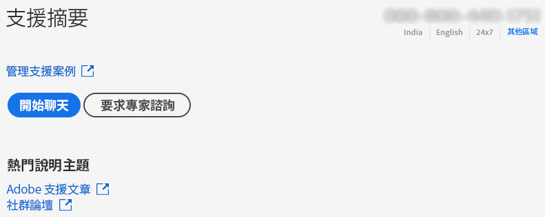
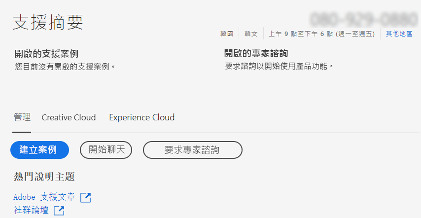
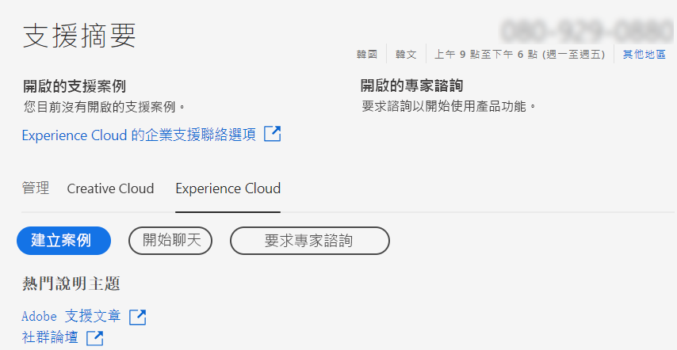

# 企業和團隊 | 聯繫 Adobe 客戶服務

要聯繫 Adobe 客戶服務，請瀏覽至 [Admin Console](https://adminconsole.adobe.com/) 的&#x200B;**支援**&#x200B;標籤。

 [Admin Console](https://adminconsole.adobe.com/) 的 **「支援」標籤**&#x200B;允許您透過簡單易用的介面存取各種支援選項。 「支援」頁籤中可用的選項取決於您的訂閱計畫。 有關詳細資訊，請按一下與您的訂閱方案對應&#x200B;**瞭解更多**。

如果您不確定您的訂閱方案，請導航到[Admin Console](https://adminconsole.adobe.com/) 的&#x200B;**支援頁籤**，並將您的視圖與下面的影像進行比較。 然後，按一下相應&#x200B;**瞭解更多**&#x200B;連結。

## 對於團隊帳戶

<!--
[Learn more](https://helpx.adobe.com/enterprise/using/support-for-teams.html)
-->

## 對於企業帳戶

<!--
[Learn more](https://helpx.adobe.com/enterprise/using/support-for-enterprise.html)
-->

## Experience Cloud

<!--
[Learn more](https://www.adobe.com/go/ac_ec_not_supported_en)
-->
