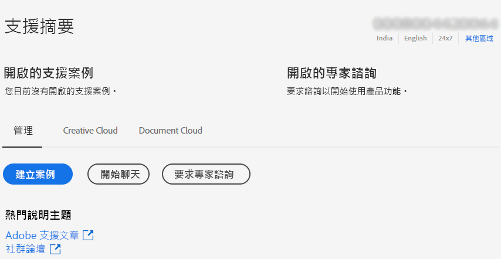
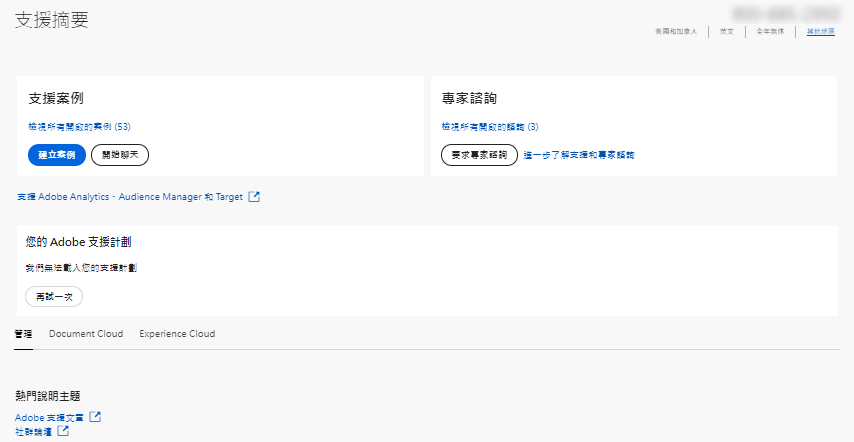

# 企業和團隊 |聯繫Adobe客戶服務

要聯繫Adobe客戶服務，請定位至 **支援** 的 [Admin Console](https://adminconsole.adobe.com/)。

的 **支援頁籤** 的 [Admin Console](https://adminconsole.adobe.com/) 允許您通過簡單易用的介面訪問各種支援選項。 「支援」頁籤中可用的選項取決於您的訂閱計畫。 有關詳細資訊，請按一下 **瞭解更多資訊** 與您的訂閱計畫對應。

如果您不確定您的訂閱計畫，請導航到 **支援頁籤** 的 [Admin Console](https://adminconsole.adobe.com/)，並將您的視圖與下面的影像進行比較。 然後，按一下相應 **瞭解更多資訊** 的子菜單。

## 對於團隊帳戶

[瞭解更多資訊](https://helpx.adobe.com/enterprise/using/support-for-teams.html)

## 對於企業帳戶

[瞭解更多資訊](https://helpx.adobe.com/enterprise/using/support-for-enterprise.html)

## Experience Cloud

[瞭解更多資訊](https://www.adobe.com/go/ac_ec_not_supported_en)
