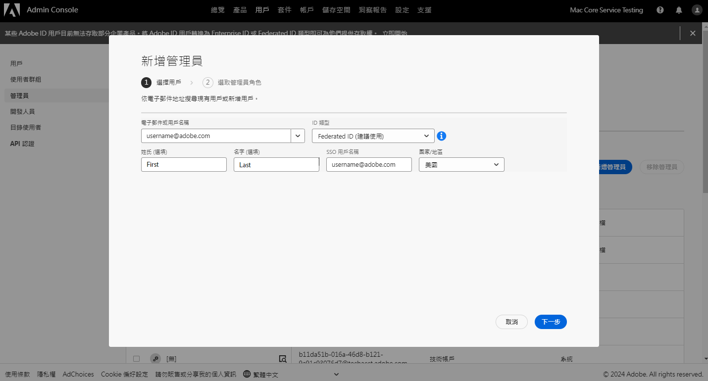
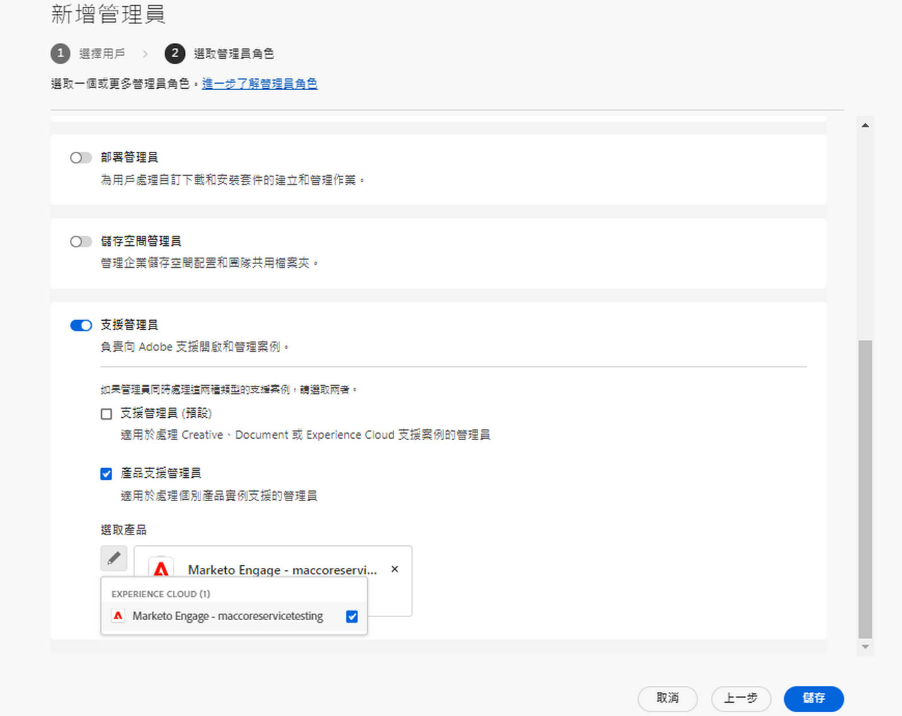
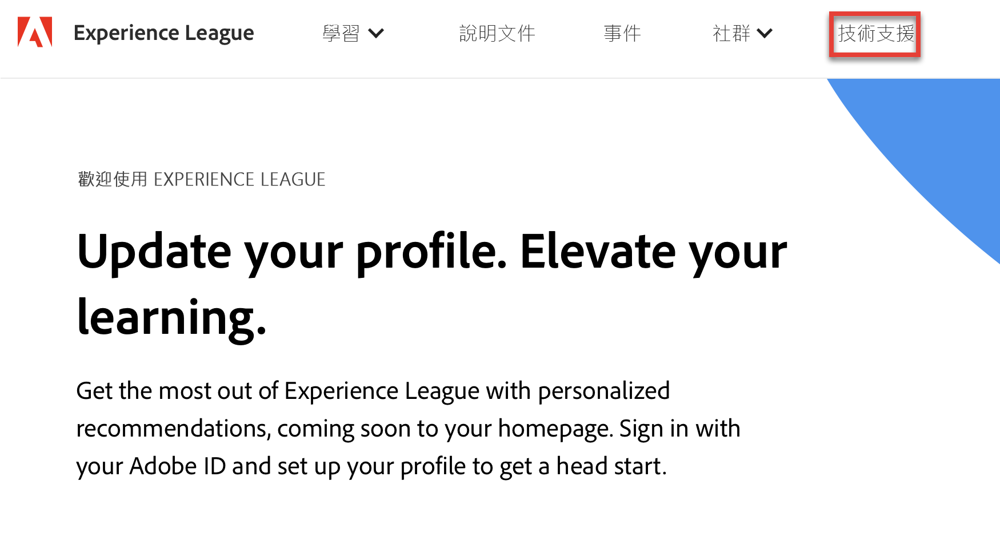

# Adobe 客戶支援體驗

## Experience League 支援票證

支援票證現在透過 [Experience League](https://experienceleague.adobe.com/home#support) 提交。有關如何提交支援票證的說明，請參閱[提交支援票證](#create-a-support-ticket-with-experience-league)章節。

我們正努力改進您與 Adobe 客戶支援人員的互動方式。我們的願景是透過移至單一進入點，使用 Experience League 來簡化支援體驗。網站上線後，您的組織便可輕鬆存取 Adobe 客戶支援、透過產品間的通用系統進一步掌握服務記錄，並透過這個單一入口網站，以電話、網頁和即時聊天等方式尋求協助。

如果您是 Adobe Commerce 使用者，請參閱《適用於 Adobe Commerce 的 Experience League 支援使用者指南》中的「[提交支援案例](https://experienceleague.adobe.com/en/docs/commerce-knowledge-base/kb/help-center-guide/magento-help-center-user-guide#support-case)」。

## 提交案例所需的支援授權角色 {#submit-ticket}

為了在 [Experience League](https://experienceleague.adobe.com/home#support) 中提交支援票證，您需要由系統管理員指派的支援管理員角色。只有組織中的系統管理員可以指派此角色。產品、產品設定檔和其他管理角色無法指派支援管理員角色，且無法檢視用於提交支援票證的&#x200B;**[!UICONTROL 建立案例]**&#x200B;選項。如需深入瞭解不同類型的管理員角色及其權利，請參閱「[管理員角色](admin-roles.md)」。

如果您使用 Commerce，則共用存取權以處理支援案例的流程有所不同。如需瞭解更多資訊，請參閱《適用於 Adobe Commerce 的 Experience League 支援使用者指南》中的「[共用存取權：授予其他使用者存取您帳戶的權限](https://experienceleague.adobe.com/en/docs/commerce-knowledge-base/kb/help-center-guide/magento-help-center-user-guide#shared-access)」。

### 新增支援可讓角色擁有組織許可權

支援管理員角色是可存取支援相關資訊的非管理角色。支援管理員可檢視、建立及管理問題報告。

新增或邀請管理員：

1. 在 Admin Console 中，選擇&#x200B;**[!UICONTROL 使用者]** > **[!UICONTROL 管理員]**。
1. 按一下&#x200B;**[!UICONTROL 新增管理員]**。
1. 輸入名稱或電子郵件地址。 

   您可以透過指定有效的電子郵件地址並在螢幕上填充資訊來搜尋現有使用者或新增使用者。

   

1. 按一下&#x200B;**[!UICONTROL 下一步]**。將顯示管理員角色清單。

若要將支援管理員角色指派給使用者（讓使用者能夠聯絡支援人員）：

1. 選取&#x200B;**[!UICONTROL 支援管理員]**&#x200B;選項。

   

1. 選擇下列兩個選項之一：

   * 選項 1：**[!UICONTROL 基本支援管理員]**。如果您要為使用者提供所有解決方案（Marketo Engage 除外）的支援存取權，請選取此選項。
   * 選項 2：**[!UICONTROL 產品支援管理員]**：選取此選項以取得 Marketo Engage 支援。選取要授與使用者支援存取權的 Marketo Engage 執行個體。

   

1. 選取之後，按一下&#x200B;**[!UICONTROL 儲存]**。

使用者從 `message@adobe.com`接收有關新管理權限的電子郵件邀請。

用戶必須按一下電子郵件中的「**開始使用**」以加入組織。如果新管理員不點擊電子郵件邀請中的&#x200B;**開始使用**&#x200B;連結，他們將無法登入 Admin Console。

在登入過程中，如果使用者沒有 Adobe 設定檔，那麼系統可能會要求他們設定一個。如果使用者具有多個與其電子郵件地址關聯的設定檔，那麼使用者必須選擇「加入團隊」（如果出現提示），然後選取與新組織關聯的設定檔。**&#x200B;**

如需詳細資訊，請按照管理角色文件中的[編輯企業管理員角色](admin-roles.md#add-enterprise-role)指示操作。請注意，只有貴組織的系統管理員可以指派此角色。如需管理階層的詳細資訊，請造訪[管理角色](admin-roles.md)文件。

### 使用 Experience League 建立支援票證

提交支援案例的流程現在直接與 Experience League 支援平台整合。這是一個自助服務入口，最近經過重新設計，為有權限的客戶提供了更多個人化資訊，並且更易於使用。

1. 如需使用 [Experience League](https://experienceleague.adobe.com/home#support) 建立票證，請選取頂部導覽中的&#x200B;**[!UICONTROL 支援]**&#x200B;標籤。
   
1. 從支援首頁，您可以輕鬆導覽至未結支援案例、記錄新案例、檢視熱門支援文章，或存取其他學習資源。
   
1. 若要提交案例，請選取&#x200B;**[!UICONTROL 開立支援票證]**。也可以選取側邊欄功能表上的&#x200B;**[!UICONTROL 開立票證]**&#x200B;選項。您將被引導至案例建立頁面，您可以在其中輸入您的產品名稱（Audience Manager、Campaign、Target 等）、案例標題以及案例說明。為加快疑難排解過程，請在描述您面臨的問題時盡可能詳細。
   
1. 在表單末尾，請填寫下列欄位。選取任何解決方案時，系統會詢問您下列內容，有些解決方案會有其他欄位：

   * 案例優先級（低、中、高、嚴重）
   * 業務影響
   * 客戶時區（美洲；歐洲、中東及非洲地區；亞太地區）

   如需案例優先順序與業務影響如何影響支援回應時間的詳細資訊，請參閱成功計畫資原始檔中的[支援的目標初始回應時間](https://experienceleague.adobe.com/en/docs/support-resources/data-sheets/overview#targeted-initial-response-times-for-support)。

>[!TIP]
>
> 如果您無法看到&#x200B;**[!UICONTROL 建立案例]**&#x200B;選項或&#x200B;**[!UICONTROL 支援]**&#x200B;標籤，則需要聯絡系統管理員以指派支援管理員角色。

>[!NOTE]
>
> 如果此問題導致生產系統中斷或嚴重中斷，則會提供電話號碼以便於您立即獲得協助。

<!--

## What About the Legacy Systems?

New Tickets/Cases will no longer be able to be submitted in legacy systems as of May 11th.  The [Admin Console](https://adminconsole.adobe.com/) will be used to submit new tickets/cases.

### Existing Tickets/Cases

* Between May 11th and May 20th the legacy systems will remain available to work existing tickets/cases to completion.
* Beginning May 20th the support team will migrate remaining open cases from the legacy systems to the new support experience.  You will receive an email notification regarding how to contact support to continue to work these cases.
-->
