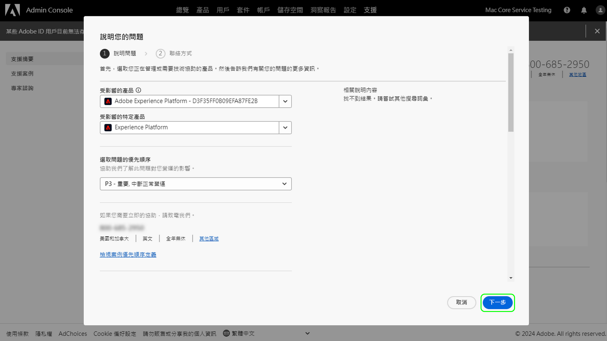

# Adobe 客戶支援體驗

## Admin Console 支援票證

現在透過 [Admin Console](https://adminconsole.adobe.com/) 就能提交支援票證。有關如何提交支援票證的說明，請參閱[提交支援票證](#submit-ticket)章節。

我們正努力改進您與 Adobe 客戶支援人員的互動方式。我們的願景是透過移至單一進入點，使用 Adobe Admin Console 來簡化支援體驗。網站上線後，您的組織便可輕鬆存取 Adobe 客戶支援、透過產品間的通用系統進一步掌握服務記錄，並透過這個單一入口網站，以電話、網頁和即時聊天等方式尋求協助。

## 如何提交 Admin Console 支援票證 {#submit-ticket}

為了在 [Admin Console](https://adminconsole.adobe.com/) 提交支援票證，您需要由系統管理員指派的支援管理員角色。只有組織中的系統管理員可以指派此角色。產品、產品設定檔和其他管理角色無法指派支援管理員角色，且無法檢視用於提交支援票證的&#x200B;**[!UICONTROL 建立案例]**&#x200B;選項。如需詳細資訊，請造訪[企業與團隊客戶服務](customer-care.md)文件。

### 指派支援管理員角色

支援管理員角色是可存取支援相關資訊的非管理角色。支援管理員可檢視、建立及管理問題報告。

新增或邀請管理員：

1. 在 Admin Console 中，選擇&#x200B;**[!UICONTROL 使用者]** > **[!UICONTROL 管理員]**。
1. 按一下&#x200B;**[!UICONTROL 新增管理員]**。
1. 輸入名稱或電子郵件地址。 

   您可以搜尋現有使用者，或透過指定有效的電子郵件地址並在畫面上填寫資訊來新增使用者。

   

1. 按一下&#x200B;**[!UICONTROL 下一步]**。 將顯示管理員角色清單。

若要將支援管理員角色指派給使用者（讓使用者能夠聯絡支援人員）：

1. 選取 **[!UICONTROL 支援管理員]** 選項。

   

1. 選擇下列兩個選項之一：

   * 選項1： **[!UICONTROL 基本支援管理員]**. 如果您要為使用者提供所有解決方案(Marketo除外)的支援存取權，請選取此選項。
   * 選項2： **[!UICONTROL 產品支援管理員]**：選取此選項以取得Marketo支援。 選取要授與使用者支援存取權的Marketo執行個體。

   

1. 選取之後，按一下 **[!UICONTROL 儲存]**.

使用者從 `message@adobe.com` 接收有關新管理權限的電子郵件邀請。

用戶必須按一下電子郵件中的「**開始使用**」以加入組織。 如果新管理員不點擊電子郵件邀請中的&#x200B;**開始使用**&#x200B;連結，他們將無法登入 Admin Console。

在登入過程中，如果使用者沒有 Adobe 設定檔，那麼系統可能會要求他們設定一個。如果使用者有多個與其電子郵件地址相關聯的設定檔，使用者必須選擇 **加入團隊** （如果提示），然後選取與新組織相關聯的設定檔。

如需詳細資訊，請前往 [編輯企業管理員角色](admin-roles.md#add-enterprise-role) 管理角色檔案中的指示。 請注意，只有貴組織的系統管理員可以指派此角色。如需管理階層的詳細資訊，請造訪[管理角色](admin-roles.md)文件。

### 使用 Admin Console 建立支援票證

如需使用 [Admin Console](https://adminconsole.adobe.com/) 建立票證，請選取頂部導覽中的&#x200B;**[!UICONTROL 支援]**&#x200B;標籤。[!UICONTROL 支援摘要]頁面會顯示。然後，選取&#x200B;**[!UICONTROL 建立案例]**&#x200B;選項。

>[!TIP]
>
> 如果您無法看到&#x200B;**[!UICONTROL 建立案例]**&#x200B;選項或&#x200B;**[!UICONTROL 支援]**&#x200B;標籤，則需要聯絡系統管理員以指派支援管理員角色。

此時會顯示一個對話方塊，您可透過此方塊選取問題類型。選取最能說明問題或疑問的問題類型，然後選取右下角的&#x200B;**[!UICONTROL 建立案例]**。

**[!UICONTROL 建立案例]**&#x200B;對話方塊會顯示。系統會要求您提供產品、優先順序、說明等資訊，並附上螢幕擷取畫面，以協助說明問題。選擇&#x200B;**[!UICONTROL 下一頁]**&#x200B;以繼續。

>[!NOTE]
>
> 如果此問題導致生產系統中斷或嚴重中斷，則會提供電話號碼以便於您立即獲得協助。

您可在下一頁填寫聯絡資訊，並提供 Adobe 客戶支援與您聯絡的最佳時間。完成後，選取右下角的&#x200B;**[!UICONTROL 提交]**，以將您的票證傳送給 Adobe 客戶支援。

<!--

## What About the Legacy Systems?

New Tickets/Cases will no longer be able to be submitted in legacy systems as of May 11th.  The [Admin Console](https://adminconsole.adobe.com/) will be used to submit new tickets/cases.

### Existing Tickets/Cases

* Between May 11th and May 20th the legacy systems will remain available to work existing tickets/cases to completion.
* Beginning May 20th the support team will migrate remaining open cases from the legacy systems to the new support experience.  You will receive an email notification regarding how to contact support to continue to work these cases.
-->
