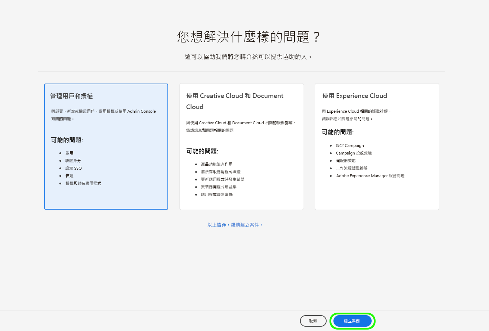

# Adobe 客戶支援體驗

## Admin Console 支援票證

現在透過 [Admin Console](https://adminconsole.adobe.com/) 就能提交支援票證。有關如何提交支援票證的說明，請參閱[提交支援票證](#submit-ticket)章節。

我們正在努力改進您與Adobe客戶支援人員的互動方式。 我們的願景是透過移至單一進入點，使用 Adobe Admin Console 來簡化支援體驗。網站上線後，您的組織便可輕鬆存取 Adobe 客戶支援、透過產品間的通用系統進一步掌握服務記錄，並透過這個單一入口網站，以電話、網頁和即時聊天等方式尋求協助。

## 需要新支援平台的幫助嗎？

我們提供一系列線上會議，客戶可能會在會議中就新的支援流程提出問題。 選擇一個或多個要加入的：

| 詳細資訊 | 日 | 日期 | 註冊連結 |
|--- |--- |--- |--- |
| [4月7日早8點](https://event.on24.com/wcc/r/3723732/5288A3B031AD858BF241EB0C0057CD85) | 圖爾 | 4月7日 | <https://event.on24.com/wcc/r/3723732/5288A3B031AD858BF241EB0C0057CD85> |
| [4月7日下午5點](https://event.on24.com/wcc/r/3723733/286EFEA9E8D9B6BB49464862F5414B8C) | 圖爾 | 4月7日 | <https://event.on24.com/wcc/r/3723733/286EFEA9E8D9B6BB49464862F5414B8C> |
| [4月20日早8點](https://event.on24.com/wcc/r/3712143/05DAF046E4BB864E7C313B056ADE4EB2) | 週三 | 4月20日 | <https://event.on24.com/wcc/r/3712143/05DAF046E4BB864E7C313B056ADE4EB2> |
| [4月20日下午5點](https://event.on24.com/wcc/r/3723740/A9EDA45FA61D3FFC4BF713419B677F16) | 週三 | 2月20日 | <https://event.on24.com/wcc/r/3723740/A9EDA45FA61D3FFC4BF713419B677F16> |
| [4月21日早8點](https://event.on24.com/wcc/r/3723741/C7EBCD38583D4D7AFCBD56029EB17C98) | 圖爾 | 4月21日 | <https://event.on24.com/wcc/r/3723741/C7EBCD38583D4D7AFCBD56029EB17C98> |
| [4月21日下午5點](https://event.on24.com/wcc/r/3723743/6F41ED2648A621F1419A56F0A52F4446) | 圖爾 | 4月21日 | <https://event.on24.com/wcc/r/3723743/6F41ED2648A621F1419A56F0A52F4446> |

## 如何提交 Admin Console 支援票證 {#submit-ticket}

為了在 [Admin Console](https://adminconsole.adobe.com/) 提交支援票證，您需要由系統管理員指派的支援管理員角色。只有組織中的系統管理員可以指派此角色。產品、產品設定檔和其他管理角色無法指派支援管理員角色，且無法檢視用於提交支援票證的&#x200B;**[!UICONTROL 建立案例]**&#x200B;選項。如需詳細資訊，請造訪[企業與團隊客戶服務](https://helpx.adobe.com/tw/enterprise/using/support-and-expert-services.html)文件。

### 指派支援管理員角色

支援管理員角色是可存取支援相關資訊的非管理角色。支援管理員可檢視、建立及管理問題報告。

若要指派支援管理員角色，請遵循管理角色文件中的[編輯企業管理員角色](https://helpx.adobe.com/tw/enterprise/using/admin-roles.html#add-admin-teams)說明。請注意，只有貴組織的系統管理員可以指派此角色。如需管理階層的詳細資訊，請造訪[管理角色](https://helpx.adobe.com/tw/enterprise/admin-guide.html/enterprise/using/admin-roles.ug.html)文件。

### 使用 Admin Console 建立支援票證

如需使用 [Admin Console](https://adminconsole.adobe.com/) 建立票證，請選取頂部導覽中的&#x200B;**[!UICONTROL 支援]**&#x200B;標籤。[!UICONTROL 支援摘要]頁面會顯示。然後，選取&#x200B;**[!UICONTROL 建立案例]**&#x200B;選項。

>[!TIP]
>
> 如果您無法看到&#x200B;**[!UICONTROL 建立案例]**&#x200B;選項或&#x200B;**[!UICONTROL 支援]**&#x200B;標籤，則需要聯絡系統管理員以指派支援管理員角色。

此時會顯示一個對話方塊，您可透過此方塊選取問題類型。選取最能說明問題或疑問的問題類型，然後選取右下角的&#x200B;**[!UICONTROL 建立案例]**。

**[!UICONTROL 建立案例]**&#x200B;對話方塊會顯示。系統會要求您提供產品、優先順序、說明等資訊，並附上螢幕擷取畫面，以協助說明問題。選擇&#x200B;**[!UICONTROL 下一頁]**&#x200B;以繼續。

>[!NOTE]
>
> 如果此問題導致生產系統中斷或嚴重中斷，則會提供電話號碼以便於您立即獲得協助。

您可在下一頁填寫聯絡資訊，並提供 Adobe 客戶支援與您聯絡的最佳時間。完成後，選取右下角的&#x200B;**[!UICONTROL 提交]**，以將您的票證傳送給 Adobe 客戶支援。

<!--

## What About the Legacy Systems?

New Tickets/Cases will no longer be able to be submitted in legacy systems as of May 11th.  The [Admin Console](https://adminconsole.adobe.com/) will be used to submit new tickets/cases.

### Existing Tickets/Cases

* Between May 11th and May 20th the legacy systems will remain available to work existing tickets/cases to completion.
* Beginning May 20th the support team will migrate remaining open cases from the legacy systems to the new support experience.  You will receive an email notification regarding how to contact support to continue to work these cases.
-->
