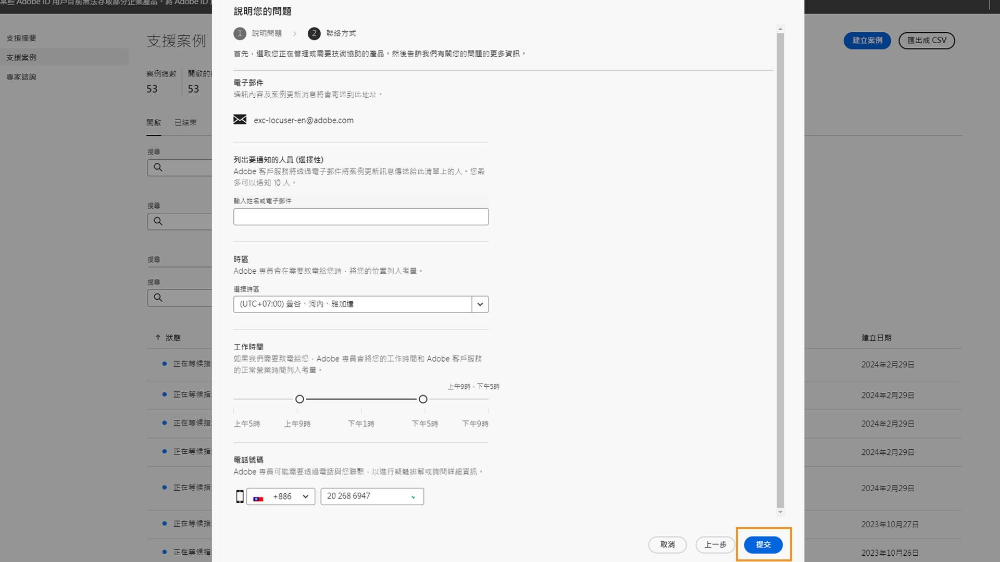

# 全新 Adobe 客戶支援體驗

## Admin Console 支援票證

很高興在此宣佈，Adobe 客戶支援體驗將於 2020 年 5 月 11 日正式上線！

現在透過 [Admin Console](https://adminconsole.adobe.com/) 就能提交支援票證.有關如何提交支援票證的說明，請查看[提交支援票證的部分](#submit-ticket)。

如先前所述，我們致力改善您與 Adobe 客戶支援的互動方式，目前先從 Adobe Experience Manager 和 Campaign 產品開始著手。我們的願景是透過移至單一進入點，使用 Adobe Admin Console 來簡化支援體驗。上線後，貴組織便能輕鬆存取Adobe客戶支援；通過跨產品的通用系統更清楚地了解您的服務歷史記錄；並透過單一入口網站，透過電話、網頁和聊天等方式尋求協助。

## 如何提交Admin Console支援票證{#submit-ticket}

要在[Admin Console](https://adminconsole.adobe.com/)中提交支援票證，需要由系統管理員分配支援管理員角色。 只有組織中的系統管理員可以指派此角色。 產品、產品配置檔案和其他管理角色無法分配支援管理員角色，並且無法查看用於提交支援票證的&#x200B;**[!UICONTROL 建立案例]**&#x200B;選項。 如需詳細資訊，請造訪[企業與團隊客戶服務](https://helpx.adobe.com/tw/enterprise/using/support-and-expert-services.html)檔案。

### 指派支援管理員角色

支援管理員角色是可存取支援相關資訊的非管理角色。 支援管理員可檢視、建立及管理問題報告。

若要指派支援管理員角色，請遵循管理角色檔案中的[編輯企業管理員角色](https://helpx.adobe.com/enterprise/using/admin-roles.html#add-admin-teams)指示。 請注意，只有貴組織的系統管理員可以指派此角色。 有關管理層次結構的詳細資訊，請訪問[管理角色](https://helpx.adobe.com/enterprise/admin-guide.html/enterprise/using/admin-roles.ug.html)文檔。

### 建立支援票證並Admin Console

要使用[Admin Console](https://adminconsole.adobe.com/)建立票證，請選擇位於頂部導航中的&#x200B;**[!UICONTROL 支援]**&#x200B;頁簽。 此時將顯示[!UICONTROL 支援摘要]頁。 接下來，選擇&#x200B;**[!UICONTROL 建立案例]**&#x200B;選項。

>[!TIP]
>
> 如果您看不到&#x200B;**[!UICONTROL Create Case]**&#x200B;選項或&#x200B;**[!UICONTROL Support]**&#x200B;頁簽，則需要聯繫系統管理員以分配Support管理員角色。

此時會出現一個對話框，允許您選擇問題類型。 選擇最能說明您的問題或問題的問題類型，然後在右下角選擇&#x200B;**[!UICONTROL 建立案例]**。

此時將顯示「建立案例」 **[!UICONTROL 對話框。]**&#x200B;系統會要求您提供產品、優先順序、說明等資訊，並附上任何螢幕擷取畫面，以協助說明問題。 選擇&#x200B;**[!UICONTROL Next]**&#x200B;以繼續。

>[!NOTE]
>
> 如果問題導致中斷或生產系統嚴重中斷，則會提供電話號碼以立即獲得協助。

下一頁可讓您填寫聯絡資訊，並提供Adobe客戶支援與您聯絡的最佳時機。 完成後，在右下角選擇&#x200B;**[!UICONTROL Submit]** ，然後您的票證將發送給Adobe客戶支援。

## 使用舊版系統怎麼辦？

自 5 月 11 日起，舊版系統將無法提交新票證/案例。若要提交新票證/案例，請改為使用 [Admin Console](https://adminconsole.adobe.com/)。

### 現有票證/案例

* 5 月 11 日至 5 月 20 日期間，舊版系統會繼續提供服務，以供處理現有票證/案例。
* 從 5 月 20 日開始，支援團隊會將剩餘未結案的案例從舊版系統移轉到新版支援體驗。到時您會收到電子郵件通知，信中會告知您如何連絡支援人員，以繼續處理這些案例。

### 案例記錄

Adobe 支援人員將可查看已結案的案例記錄。如果您需要結案案例的相關說明，請參閱以下「需要協助嗎？」一節。

## 需要協助嗎？

新網站上線後，如果您遇到任何問題而無法登入新工具，可選擇使用下列支援選項：

### 選項 1：提交票證

在 [Experience League](https://experienceleague.adobe.com/?support-solution=General#support) 提交票證以連絡我們，並在票證中加入：

* 詳細連絡資訊：姓名、電子郵件地址、電話
* 公司名稱
* 擁有的 Adobe 產品
* 問題優先順序
* 問題的簡短說明

### 選項 2：5 月 11 日之前

5 月 11 日前，您仍可繼續使用舊版 [Campaign Extranet](https://support.neolane.net/webApp/extranetLogin) 或 [Experience Manager Daycare](https://daycare.day.com/home.html) 案例管理系統。5 月 11 日後，這些系統將無法受理新案例，因此系統會將您重新導向至 [Admin Console](https://adminconsole.adobe.com/)。

若對這封電子郵件的內容有任何疑問，請到 [Experience League](https://experienceleague.adobe.com/?support-solution=General#support) 提交票證與我們連絡。
